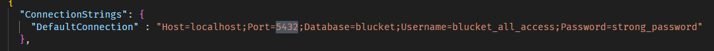
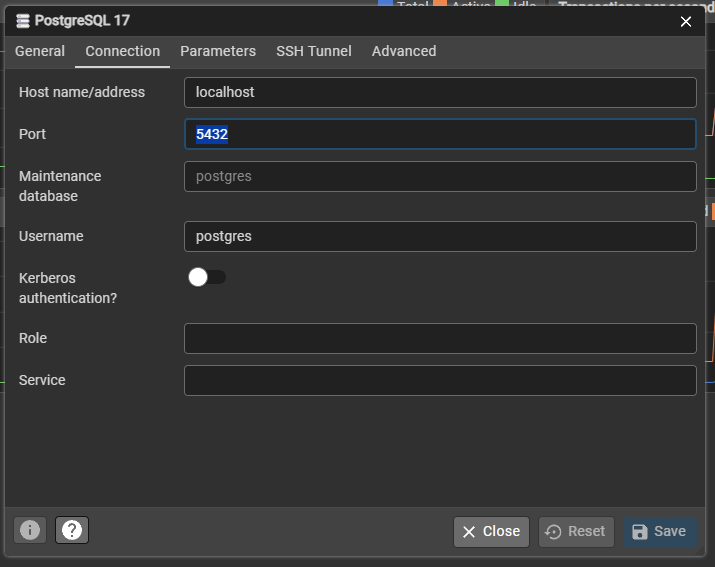

## Setup

1. Open pgAdmin and copy the contents of DatabaseSetup.sql into the query tool.

2. Execute every line of code separately starting from line 14 (line 1 - 13 are for dropping the database).

3. Go to "appsettings.Development.json", look for the DefaultConnection string and make sure it matches your Postgres port.
   
   

4. Run "dotnet ef database update" in your CLI to set up the tables in the database.
